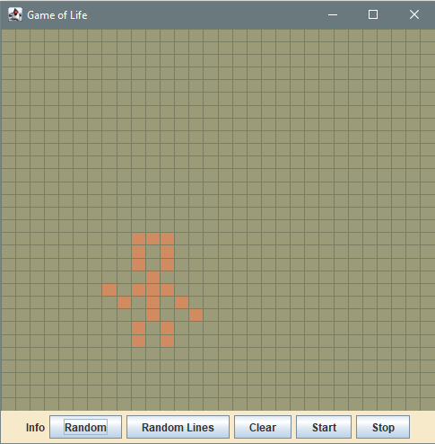
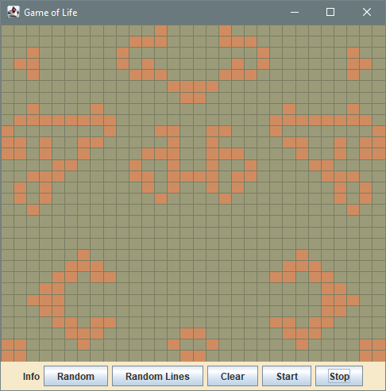

# GameOfLife

(Start setting according to [xkcd comic "RIP John Conway"](https://xkcd.com/2293/))

Hackathon Project (starting 06 November 2020)

Conway's Game of Life in Java with Swing.

### Functionality:

* Click on the map to spawn new or delete existing organisms (works only in stopped mode).
* Random: random spawing of organisms all over the map (50 % probability).
* Random Lines: random horizontal lines all over the map (50 % probability).
* Clear: empties the whole map.
* Start: starts evolution.
* Stop: stops evolution.

(Symmetrical development with random lines setting)
